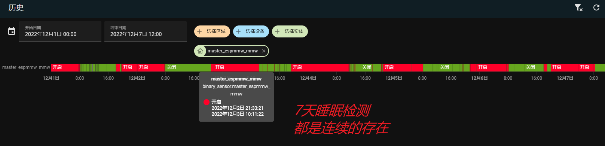
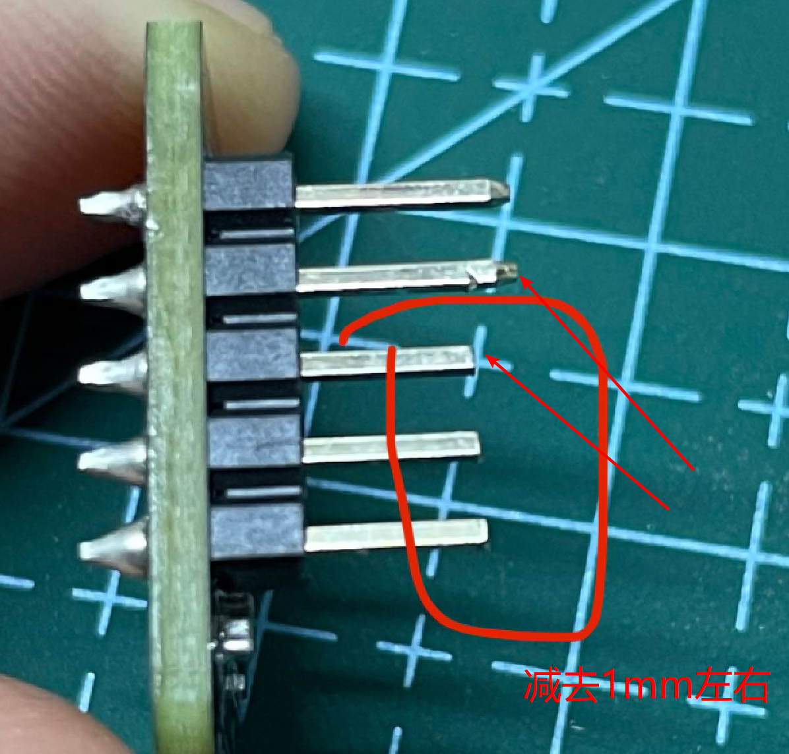
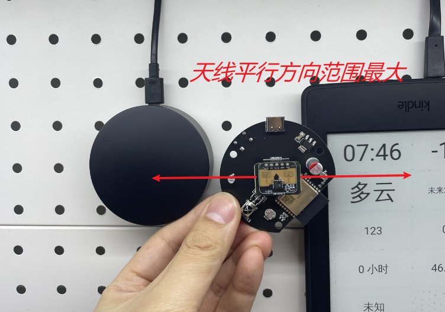

# ESPMMW-X

## 简介

讨论群: [810581215](https://qm.qq.com/cgi-bin/qm/qr?k=vNK4CIj_CZiKa_sp-mL8qP5cCqGs8-dZ&jump_from=webapi&authKey=Pu4vNUR+DD4cEF7r4nU0XO7SCHHpSVETB66ms4YGvbn27MWzkgaSrcHAN5/Dhuch)


### 雷达特点：

- 外观精致
- 支持磁吸底座
- 多功能：人体存在，距离调节，呼吸检测，环境亮度，红外遥控（支持收发，自定义功能），蓝牙网关（测试过[米家低功耗](https://esphome.io/components/sensor/xiaomi_ble.html)）
- 方便二次开发：TYPE-C 接口，支持串口调试（[USB Serial/JTAG](https://docs.espressif.com/projects/esp-idf/en/latest/esp32c3/api-guides/usb-serial-jtag-console.html)）
- 成本低廉（总体硬件成本 60 左右）
- 稳定性极好
- 主控 ESP32C3
  

### 材料清单

！！！单排母一定要选 5.0 塑高的 ！！！



用剪刀减去针脚 1mm 左右方便插入底座，为什么要这么折腾，实验出来的，否则雷达和壳贴的太近会影响雷达工作

| 名称                                      | 型号                               | 数量 |       PCB 标注       |                           链接                            |
| ----------------------------------------- | ---------------------------------- | ---: | :------------------: | :-------------------------------------------------------: |
| X-RA2413MT 毫米波雷达模块                 |                                    |    1 |      X-RA2413MT      | [购买](https://item.taobao.com/item.htm?id=674222948400)  |
| VS/HX1838/PC638 红外接收头                |                                    |    1 |        HX1838        | [购买](https://item.taobao.com/item.htm?id=522552967131)  |
| 3MM 940nm 红外发射管                      |                                    |    2 |       LA / LB        | [购买](https://item.taobao.com/item.htm?id=522572541770)  |
| 光敏电阻 5516                             |                                    |    1 |        GL5516        | [购买](https://item.taobao.com/item.htm?id=522556415238)  |
| ME1117A33B3G 线性稳压器                   |                                    |    1 |        1117-3        | [购买](https://item.taobao.com/item.htm?id=645921052512)  |
| ESP32-C3-WROOM-02-H4 模块                 |                                    |    1 | ESP32-C3-WROOM-02-H4 | [购买](https://item.taobao.com/item.htm?id=672590753429)  |
| 贴片 S8050 J3Y 贴片三极管 500MA SOT-23    |                                    |    1 |         J3Y          | [购买](https://item.taobao.com/item.htm?id=522577964105)  |
| 0603 贴片电阻 1MΩ 1 兆欧 1/10W 精度 ±1%   |                                    |    1 |          R1          | [购买](https://item.taobao.com/item.htm?id=525898476191)  |
| 0603 贴片电阻 10KΩ 10 千欧 1/10W 精度 ±1% |                                    |    3 |     R2 / R3 / R4     | [购买](https://item.taobao.com/item.htm?id=525777943950)  |
| 直插固态电解电容 1000uF 6.3V 6.3\*11.5mm  |                                    |    1 |          C1          | [购买](https://item.taobao.com/item.htm?id=610051037283)  |
| 1206 贴片电容 4.7UF                       |                                    |    1 |          C2          | [购买](https://item.taobao.com/item.htm?id=522554031501)  |
| 2.54mm 间距 单排母                        | 2.54mm-1\*5P 单排母 5.0 塑高！！！ |    1 |      X-RA2413MT      | [购买](https://item.taobao.com/item.htm?id=578467867387)  |
| 贴片 USB-3.1 插座 Type-C 母座 16P         |                                    |    1 |        TYPE-C        | [购买](https://item.taobao.com/item.htm?id=573090887123)  |
| 直插 6\*6 轻触开关                        | 5、0 高                            |    1 |        BUTTON        |  [购买](https://item.taobao.com/item.htm?id=36605575136)  |
| 红外转发器外壳                            |                                    |    1 |          -           |  [购买](https://detail.1688.com/offer/653134990795.html)  |
| 304 不锈钢平头自攻螺丝                    | M1.7\*6                            |    3 |    外壳商家也会送    | [购买](https://detail.tmall.com/item.htm?id=529579107673) |
| 车载磁吸出风口手机支架                    |                                    |    1 |          -           |  [购买](https://detail.1688.com/offer/632680243184.html)  |

### DIY 步骤

打板(板厚选 1mm)-->焊接-->组装-->刷机

### 固件特点：

- 支持运动、静止状态显示
- 检测距离显示
- 动静距离显示，能量显示
- 动静灵敏度调节
- 动静距离调节
- ESP32 状态显示（IP、MAC、CPU 温度，运行时间）
- 蓝牙代理
- 红外收发
- OTA

## GPIO

| GPIO | 功能           |
| ---- | -------------- |
| 0    | 红外接收       |
| 1    | 红外发射       |
| 2    | 背部自定义按键 |
| 3    | 光敏电阻电压   |
| 4    | 毫米波状态     |
| 5、6 | 毫米波串口     |

## ESPHOME


| 组件                       | 含义                                                          |
| -------------------------- | ------------------------------------------------------------- |
| espmmw_brightness          | 环境亮度                                                      |
| espmmw_button              | 毫米波背后按钮                                                |
| espmmw_cpu_temprature      | CPU 温度                                                      |
| espmmw_get_conf            | 获取当前毫米波配置                                            |
| espmmw_ip                  | IP                                                            |
| espmmw_mac                 | MAC                                                           |
| espmmw_max_move_distance   | 最大移动距离调节（最大距离=n\*0.75 米）                       |
| espmmw_max_static_distance | 最大静止距离调节 （最大距离=n\*0.75 米）                      |
| espmmw_mmw                 | 毫米波状态（ON-有人，OFF-无人）态                             |
| espmmw_mmw_status          | 毫米波状态（OFF-关闭，MOVE-运动，STATIC-静止，ON 运动或静止） |
| espmmw_move_distance       | 当前运动距离                                                  |
| espmmw_move_energy         | 当前运动能量值                                                |
| espmmw_move_sensitivity    | 移动灵敏度调节                                                |
| espmmw_reboot              | 重启 esp                                                      |
| espmmw_reset_mmw           | 重置毫米波设置                                                |
| espmmw_rr_b_1              | 红外接收 demo                                                 |
| espmmw_signal              | WiFi 信号强度                                                 |
| espmmw_static_distance     | 当前静止距离                                                  |
| espmmw_static_energy       | 当前静止能量值                                                |
| espmmw_static_sensitivity  | 静止灵敏度调节                                                |
| espmmw_tv_on_off           | 红外发送 demo                                                 |
| espmmw_unattended_duration | 无人持续时间调节                                              |
| espmmw_uptime              | 运行时间                                                      |

## 教程

- 编译和刷机接入 HASS

  esphome 安装的根据自己环境来，以下是我自己安装方式，尽量装最新版本

  Linux （ 以下是在 x86 的 Ubuntu 下操作的，其他 Linux 类似）

  1、[安装 docker 及 docker-compose](https://www.bilibili.com/video/BV1vv4y1c7iQ/)

  2、docker-compose.yml 文件增加如下内容

  ```yml
  version: "3"
    services:

      esphome:
        image: esphome/esphome:latest
        container_name: esphome
        volumes:
          - /etc/localtime:/etc/localtime:ro
          - /opt/esphome/conf:/config
          - /dev:/dev
        environment:
          - TZ=Asia/Shanghai
        network_mode: host
        restart: always
        privileged: true
  ```

  3、安装 esphome 的 docker

  ```bash
  docker-compose -f docker-compose.yml up -d
  ```

  4、打开 esphome 的页面 http://IP:6052，新增 espmmw 的配置文件，编辑配置文件删除全部，将文件夹[esphme](https://github.com/liwei19920307/ESPMMW/tree/X-RA2413MT/esphome)的配置粘贴上去，按需修改后保存，mini 文件夹内是自用精简版本，去除了一些无用的距离信息，只保留参数调节

  5、docker 服务器执行如下命令进入 esphome 的 docker 内部

  ```bash
  docker exec -it esphome bash
  ```

  6、设置 https 代理（这部比较重要，编译需要从 git 下载依赖）

  ```bash
  export https_proxy=http://IP:PORT
  ```

  7、将毫米波通过数据线插入服务器

  8、执行编译并刷入

  ```bash
  esphome run espmmw.yaml
  ```

  Windows

  将编译的固件放入[flash_tool](https://github.com/liwei19920307/ESPMMW/tree/X-RA2413MT/flash_tool)，按说明操作

  7、接入 HASS

  

- 有人无人触发过程

  | 组件                       | 含义                            |
  | -------------------------- | ------------------------------- |
  | espmmw_mmw                 | 毫米波状态（ON-有人，OFF-无人） |
  | espmmw_move_energy         | 当前运动能量值                  |
  | espmmw_move_sensitivity    | 移动灵敏度调节                  |
  | espmmw_static_energy       | 当前静止能量值                  |
  | espmmw_static_sensitivity  | 静止灵敏度调节                  |
  | espmmw_unattended_duration | 无人持续时间调节                |

  1、当 espmmw_move_energy 超大于设定的 espmmw_move_sensitivity 时 espmmw_mmw 触发 ON

  2、当 espmmw_static_energy 小于设定的 espmmw_static_sensitivity 时 espmmw_mmw 触发 OFF

  3、espmmw_mmw 触发 ON 之前都是通过 espmmw_move_energy 的值判断的，一旦触发 ON 后，后面的检测都是通过 espmmw_static_energy 来判断是否 OFF 的

  4、我把 espmmw_move_sensitivity 设置成 99 是为了防止一些轻微的动作误触有人，比如阳台的衣服或者窗帘微动

  5、我把 espmmw_static_sensitivity 设置成 15 是为了更好的检测呼吸，防止误触无人

  6、实际使用中大家可以根据环境内的 espmmw_static_energy 值来设置，因为有些环境 espmmw_static_energy 就是高于 15 的，我自己家用 15 是没啥问题的，但有些地方调高一点比如阳台，防止衣服微动导致无法触发 espmmw_mmw 的 OFF

- 红外收发

  红外接收一般用来学习遥控器后模拟，或者接收指定代码后，执行特定操作

  [收 RAW 码](https://www.bilibili.com/video/BV1jg411r7mz)

  ```yml
  remote_receiver:
    pin:
      number: 0
      inverted: true
    rmt_channel: 2
    dump: all
  ```

  发 RAW 码

  将学习到的 RAW 码填入

  ```yml
  remote_transmitter:
    pin: 1
    carrier_duty_percent: 50%

  button:
    - platform: template
      name: ${device_name}_tv_on_off
      on_press:
        - remote_transmitter.transmit_raw:
            carrier_frequency: 38kHz
            code:
              [#这里放入日志中打印的RAW码]
  ```

- SmartIR

  有空更新，可以先看看[这里](https://github.com/smartHomeHub/SmartIR)

- 蓝牙网关

  目前蓝牙网关相关功能还有问题不建议用， 蓝牙的 2.4G 和 WiFi 的 2.4G 有会干扰，建议长期测试再使用

  直接采集

  [米家低功耗](https://esphome.io/components/sensor/xiaomi_ble.html)

  [Bindkey 获取](https://github.com/PiotrMachowski/Xiaomi-cloud-tokens-extractor/releases/latest/download/token_extractor.exe)

  ```yml
  esp32_ble_tracker:
    - platform: xiaomi_lywsd03mmc
      mac_address: #mac
      bindkey: #bindkey
      temperature:
        name: ${device_name}_mi_temperature
      humidity:
        name: ${device_name}_mi_humidity
      battery_level:
        name: ${device_name}_mi_battery
  ```

  ESPHOME 代理

  ESPHOME 和 HA 添加配置后重启，HA 集成里就会出现支持的设备，配置如下

  HA 的 configuration.yaml 添加

  ```yml
  # Bluetooth
  bluetooth:
  ```

  ESPHOME 配置添加

  ```yml
  esphome:
    name: ${device_name}
    on_boot:
      - priority: 600
        then:
          - esp32_ble_tracker.stop_scan:

  esp32_ble_tracker:
    scan_parameters:
      interval: 1100ms
      window: 1100ms

  bluetooth_proxy:
    active: true

  time:
    - platform: sntp
      on_time:
        # Every 1 minutes
        - seconds: 0
          minutes: /1
          then:
            - esp32_ble_tracker.start_scan:
  ```

  

## 安装

- 安装尽量选择墙上安装，不建议吸顶安装
- 尽量将电源口对地或天，使天线平行地面获得最大范围
- 安装及雷达范围参考[X-RA2413MT.pdf](https://github.com/liwei19920307/ESPMMW/tree/X-RA2413MT/doc/X-RA2413MT.pdf)
  

## 问题

- You tell me

## 细节


## 场景


