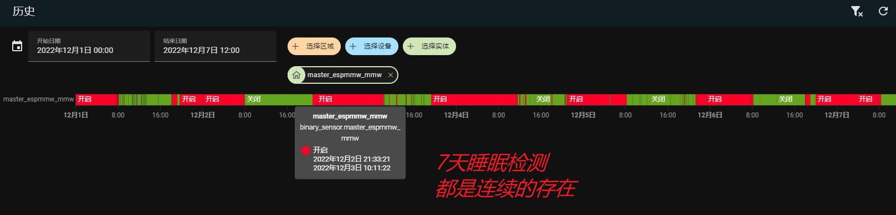

# ESPMMW-X

## 简介

讨论群: [810581215](https://qm.qq.com/cgi-bin/qm/qr?k=vNK4CIj_CZiKa_sp-mL8qP5cCqGs8-dZ&jump_from=webapi&authKey=Pu4vNUR+DD4cEF7r4nU0XO7SCHHpSVETB66ms4YGvbn27MWzkgaSrcHAN5/Dhuch)


### 雷达特点：

- 外观精致
- 支持磁吸底座
- 多功能：人体存在，距离调节，呼吸检测，环境亮度，红外遥控（支持收发，自定义功能），蓝牙网关（测试过[米家低功耗](https://esphome.io/components/sensor/xiaomi_ble.html)）
- 方便二次开发：TYPE-C 接口，支持串口调试（[USB Serial/JTAG](https://docs.espressif.com/projects/esp-idf/en/latest/esp32c3/api-guides/usb-serial-jtag-console.html)）
- 成本低廉（总体硬件成本 60 左右）
- 稳定性极好
- 主控 ESP32C3



### 固件特点：

- 支持运动、静止状态显示
- 检测距离显示
- 动静距离显示，能量显示
- 动静灵敏度调节
- 动静距离调节
- ESP32 状态显示（IP、MAC、CPU 温度，运行时间）
- 蓝牙代理
- 红外收发
- OTA

### GPIO

| GPIO | 功能           |
| ---- | -------------- |
| 0    | 红外接收       |
| 1    | 红外发射       |
| 2    | 背部自定义按键 |
| 3    | 光敏电阻电压   |
| 4    | 毫米波状态     |
| 5、6 | 毫米波串口     |

## DIY 步骤

打板(板厚选 1mm)-->焊接-->组装-->刷机

### 材料清单

| 名称                                      | 型号                               | 数量 |       PCB 标注       |                           链接                            |
| ----------------------------------------- | ---------------------------------- | ---: | :------------------: | :-------------------------------------------------------: |
| X-RA2413MT 毫米波雷达模块                 |                                    |    1 |      X-RA2413MT      | [购买](https://item.taobao.com/item.htm?id=674222948400)  |
| VS/HX1838/PC638 红外接收头                |                                    |    1 |        HX1838        | [购买](https://item.taobao.com/item.htm?id=522552967131)  |
| 3MM 940nm 红外发射管                      |                                    |    2 |       LA / LB        | [购买](https://item.taobao.com/item.htm?id=522572541770)  |
| 光敏电阻 5516                             |                                    |    1 |        GL5516        | [购买](https://item.taobao.com/item.htm?id=522556415238)  |
| ME1117A33B3G 线性稳压器                   |                                    |    1 |        1117-3        | [购买](https://item.taobao.com/item.htm?id=645921052512)  |
| ESP32-C3-WROOM-02-H4 模块                 |                                    |    1 | ESP32-C3-WROOM-02-H4 | [购买](https://item.taobao.com/item.htm?id=672590753429)  |
| 贴片 S8050 J3Y 贴片三极管 500MA SOT-23    |                                    |    1 |         J3Y          | [购买](https://item.taobao.com/item.htm?id=522577964105)  |
| 0603 贴片电阻 1MΩ 1 兆欧 1/10W 精度 ±1%   |                                    |    1 |          R1          | [购买](https://item.taobao.com/item.htm?id=525898476191)  |
| 0603 贴片电阻 10KΩ 10 千欧 1/10W 精度 ±1% |                                    |    3 |     R2 / R3 / R4     | [购买](https://item.taobao.com/item.htm?id=525777943950)  |
| 直插固态电解电容 1000uF 6.3V 6.3\*11.5mm  |                                    |    1 |          C1          | [购买](https://item.taobao.com/item.htm?id=610051037283)  |
| 1206 贴片电容 4.7UF                       |                                    |    1 |          C2          | [购买](https://item.taobao.com/item.htm?id=522554031501)  |
| 2.54mm 间距 单排母                        | 2.54mm-1\*5P 单排母 5.0 塑高！！！ |    1 |      X-RA2413MT      | [购买](https://item.taobao.com/item.htm?id=578467867387)  |
| 贴片 USB-3.1 插座 Type-C 母座 16P         |                                    |    1 |        TYPE-C        | [购买](https://item.taobao.com/item.htm?id=573090887123)  |
| 直插 6\*6 轻触开关                        | 5、0 高                            |    1 |        BUTTON        |  [购买](https://item.taobao.com/item.htm?id=36605575136)  |
| 红外转发器外壳                            |                                    |    1 |          -           |  [购买](https://detail.1688.com/offer/653134990795.html)  |
| 304 不锈钢平头自攻螺丝                    | M1.7\*6                            |    3 |    外壳商家也会送    | [购买](https://detail.tmall.com/item.htm?id=529579107673) |
| 车载磁吸出风口手机支架                    |                                    |    1 |          -           |  [购买](https://detail.1688.com/offer/632680243184.html)  |

## ESPHome

- 配置

  ```yml
  substitutions:
    device_name: master_espmmw

  esphome:
    name: ${device_name}

  esp32:
    board: esp32-c3-devkitm-1
    framework:
      type: arduino
      version: latest

  external_components:
    - source: github://liwei19920307/ESPMMW
      components: [ ra2413mt ]

  logger:
    level: debug

  debug:
    update_interval: 5s

  api:
    encryption:
      key: !secret api_encryption_key

  ota:
    - platform: esphome
      password: !secret ota_password

  wifi:
    ssid: !secret wifi_ssid
    password: !secret wifi_password
    fast_connect: on

  web_server:
    port: 80
    version: 3
    include_internal: true

  uart:
    - id: ra2413mt_uart
      rx_pin: 5
      tx_pin: 6
      baud_rate: 256000
      data_bits: 8
      stop_bits: 1

  ra2413mt:
    uart_id: ra2413mt_uart

  text_sensor:
    - platform: wifi_info
      ip_address:
        name: ${device_name}_ip
        icon: mdi:ip-outline
        internal: true
      mac_address:
        name: ${device_name}_mac
        icon: mdi:map-marker-outline
        internal: true

  binary_sensor:
    - platform: gpio
      pin: 4
      name: ${device_name}_mmw
      device_class: occupancy
      icon: mdi:motion-sensor
    - platform: gpio
      pin:
        number: 2
        mode:
          input: true
          pullup: true
        inverted: true
      name: ${device_name}_button
      icon: mdi:radiobox-marked
      internal: true
      on_press:
        then:
          - button.press: ${device_name}_reset_conf

  sensor:
    - platform: wifi_signal
      name: ${device_name}_signal
      icon: mdi:signal
      internal: true
    - platform: debug
      free:
        name: ${device_name}_free
        unit_of_measurement: "KB"
        internal: true
        filters:
          - lambda: |-
              return x / 1024;
      block:
        name: ${device_name}_max_block
        unit_of_measurement: "KB"
        internal: true
        filters:
          - lambda: |-
              return x / 1024;
      loop_time:
        name: ${device_name}_loop_time
        internal: true
    - platform: adc
      pin: 3
      name: ${device_name}_brightness
      attenuation: 11db
      update_interval: 5s
      unit_of_measurement: "%"
      icon: mdi:brightness-6
      accuracy_decimals: 0
      filters:
        - lambda: |-
            return ( 3 - x ) / 0.03;
    - platform: internal_temperature
      name: ${device_name}_cpu_temprature
      icon: mdi:thermometer
      internal: true
    - platform: ra2413mt
      move_distance:
        name: ${device_name}_move_distance
        internal: true
      move_energy:
        name: ${device_name}_move_energy
        internal: true
      static_distance:
        name: ${device_name}_static_distance
        internal: true
      static_energy:
        name: ${device_name}_static_energy
        internal: true

  number:
    - platform: ra2413mt
      max_move_distance:
        name: ${device_name}_max_move_distance
        default: 4.5
        internal: true
      max_static_distance:
        name: ${device_name}_max_static_distance
        default: 4.5
        internal: true
      move_sensitivity:
        name: ${device_name}_move_sensitivity
        default: 99
        internal: true
      static_sensitivity:
        name: ${device_name}_static_sensitivity
        default: 15
        internal: true
      unattended_duration:
        name: ${device_name}_unattended_duration
        default: 5
        internal: true

  button:
    - platform: restart
      name: ${device_name}_reboot
      internal: true
    - platform: ra2413mt
      get_conf:
        name: ${device_name}_get_conf
        internal: true
      reset_conf:
        id: ${device_name}_reset_conf
        name: ${device_name}_reset_conf
        internal: true
    - platform: template
      name: ${device_name}_tv_on_off
      icon: mdi:remote-tv
      on_press:
        - remote_transmitter.transmit_raw:
            carrier_frequency: 38kHz
            code:
              [9045, -4500, 585, -520, 578, -527, 580, -525, 578, -527, 586, -518, 579, -525, 580, -525, 585, -519, 569, -1641, 583, -1626, 585, -1624, 580, -1628, 586, -1677, 579, -1630, 580, -526, 583, -1625, 586, -1623, 586, -519, 586, -1622, 582, -1628, 587, -518, 580, -524, 585, -520, 586, -519, 584, -520, 585, -1650, 584, -521, 588, -517, 580, -1630, 584, -1624, 585, -1624, 586, -1623, 585]

  remote_transmitter:
    pin: 1
    carrier_duty_percent: 50%

  remote_receiver:
    pin:
      number: 0
      inverted: true
    rmt_channel: 2
    dump: all
  ```

- 中文含义

  

  | 组件                       | 含义                              |
  | -------------------------- | --------------------------------- |
  | espmmw_brightness          | 环境亮度                          |
  | espmmw_button              | 毫米波背后按钮                    |
  | espmmw_get_conf            | 获取当前毫米波配置                |
  | espmmw_max_move_distance   | 最大运动检测距离调节              |
  | espmmw_max_static_distance | 最大静止检测距离调节              |
  | espmmw_mmw                 | 毫米波状态（ON-有人，OFF-无人）态 |
  | espmmw_move_distance       | 当前运动物体距离                  |
  | espmmw_move_energy         | 当前运动物体能量值                |
  | espmmw_move_sensitivity    | 运动灵敏度调节                    |
  | espmmw_reset_mmw           | 重置毫米波设置                    |
  | espmmw_static_distance     | 当前静止物体距离                  |
  | espmmw_static_energy       | 当前静止物体能量值                |
  | espmmw_static_sensitivity  | 静止灵敏度调节                    |
  | master_espmmw_tv_on_off    | 红外遥控 demo                     |
  | espmmw_unattended_duration | 无人持续时间调节                  |

### 触发过程

有人无人触发过程

1. 当 espmmw_move_energy 超大于设定的 espmmw_move_sensitivity 时 espmmw_mmw 触发 ON

2. 当 espmmw_static_energy 小于设定的 espmmw_static_sensitivity 时 espmmw_mmw 触发 OFF

3. espmmw_mmw 触发 ON 之前都是通过 espmmw_move_energy 的值判断的，一旦触发 ON 后，后面的检测都是通过 espmmw_static_energy 来判断是否 OFF 的

4. 把 espmmw_move_sensitivity 设置成 99 是为了防止一些轻微的动作误触有人，比如阳台的衣服或者窗帘微动

5. 把 espmmw_static_sensitivity 设置成 15 是为了更好的检测呼吸，防止误触无人

6. 实际使用中大家可以根据环境内的 espmmw_static_energy 值来设置，因为有些环境 espmmw_static_energy 就是高于 15 的，我自己家用 15 是没啥问题的，但有些地方调高一点比如阳台，防止衣服微动导致无法触发 espmmw_mmw 的 OFF

### 红外收发

红外接收一般用来学习遥控器后模拟，或者接收指定代码后，执行特定操作

- [收 RAW 码](https://www.bilibili.com/video/BV1jg411r7mz)

  ```yml
  remote_receiver:
    pin:
      number: 0
      inverted: true
    rmt_channel: 2
    dump: all
  ```

- 发 RAW 码

  将学习到的 RAW 码填入

  ```yml
  remote_transmitter:
    pin: 1
    carrier_duty_percent: 50%

  button:
    - platform: template
      name: ${device_name}_tv_on_off
      on_press:
        - remote_transmitter.transmit_raw:
            carrier_frequency: 38kHz
            code:
              [#这里放入日志中打印的RAW码]
  ```

- SmartIR

  看看[这里](https://github.com/smartHomeHub/SmartIR)

### 蓝牙网关

目前蓝牙网关相关功能还有问题不建议用， 蓝牙的 2.4G 和 WiFi 的 2.4G 有会干扰，建议长期测试再使用

- 直接采集

  [米家低功耗](https://esphome.io/components/sensor/xiaomi_ble.html)

  [Bindkey 获取](https://github.com/PiotrMachowski/Xiaomi-cloud-tokens-extractor/releases/latest/download/token_extractor.exe)

  ```yml
  esp32_ble_tracker:
    - platform: xiaomi_lywsd03mmc
      mac_address: #mac
      bindkey: #bindkey
      temperature:
        name: ${device_name}_mi_temperature
      humidity:
        name: ${device_name}_mi_humidity
      battery_level:
        name: ${device_name}_mi_battery
  ```

- ESPHOME 蓝牙代理

  ESPHOME 和 HA 添加配置后重启，HA 集成里就会出现支持的设备，配置如下

  HA 的 configuration.yaml 添加

  ```yml
  # Bluetooth
  bluetooth:
  ```

  ESPHOME 配置添加

  ```yml
  esphome:
    name: ${device_name}
    on_boot:
      - priority: 600
        then:
          - esp32_ble_tracker.stop_scan:

  esp32_ble_tracker:
    scan_parameters:
      interval: 1100ms
      window: 1100ms

  bluetooth_proxy:
    active: true

  time:
    - platform: sntp
      on_time:
        # Every 1 minutes
        - seconds: 0
          minutes: /1
          then:
            - esp32_ble_tracker.start_scan:
  ```

  

## 注意事项

- 安装尽量选择墙上安装，不建议吸顶安装
- 尽量将电源口对地或天，使天线平行地面获得最大范围
- 安装及雷达范围参考[X-RA2413MT.pdf](https://github.com/liwei19920307/ESPMMW/tree/X-RA2413MT/doc/X-RA2413MT.pdf)
  

## 问题

- You tell me

## 细节


## 场景


