# ESPMMW-X

## 简介

讨论群：[810581215](https://qm.qq.com/cgi-bin/qm/qr?k=vNK4CIj_CZiKa_sp-mL8qP5cCqGs8-dZ&jump_from=webapi&authKey=Pu4vNUR+DD4cEF7r4nU0XO7SCHHpSVETB66ms4YGvbn27MWzkgaSrcHAN5/Dhuch)

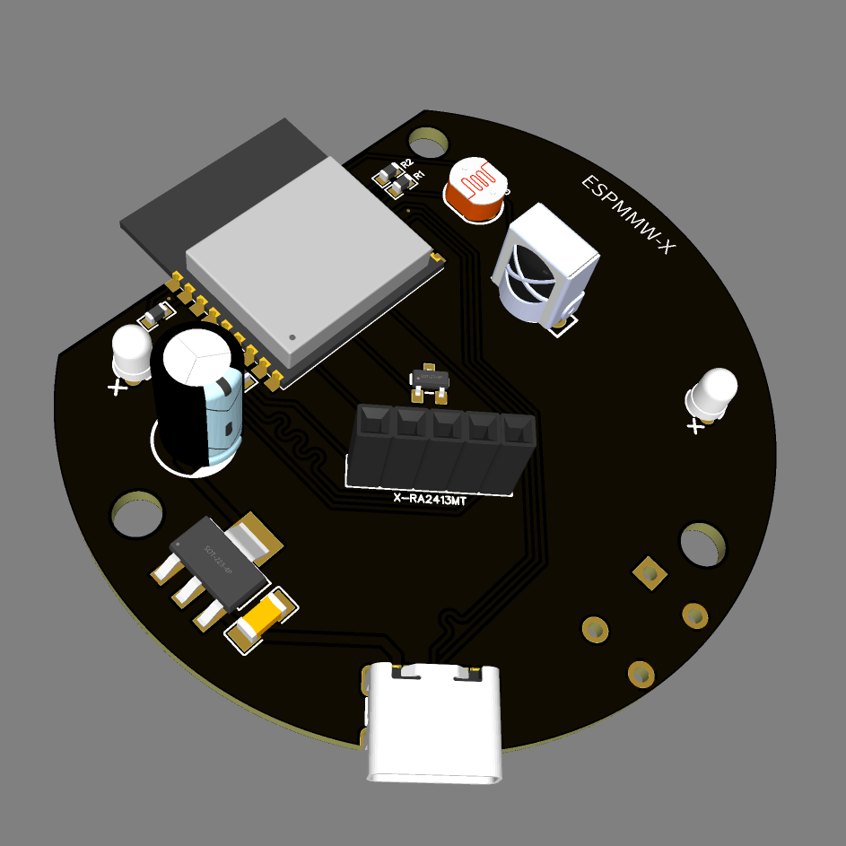

### 雷达特点

- 外观精致，支持磁吸底座
- 多功能：人体存在、距离调节、呼吸检测、环境亮度、红外遥控（收发 / 自定义）、蓝牙网关（测试过 [米家低功耗](https://esphome.io/components/sensor/xiaomi_ble.html)）
- 方便二次开发：TYPE-C，支持串口调试（[USB Serial/JTAG](https://docs.espressif.com/projects/esp-idf/en/latest/esp32c3/api-guides/usb-serial-jtag-console.html)）
- 成本低（硬件约 60 元量级），稳定性好
- 主控 ESP32-C3

### 固件特点

- 运动 / 静止状态与距离、能量显示（含 Web 滑动条）
- 灵敏度、检测距离可调
- 背后按键：短按 30s 后自动灵敏度校准；长按 3s 先复位雷达再恢复出厂并重启
- 多设备：改 `friendly_name` / `name` 区分；实体用短名，HA 侧靠设备名区分
- IP、MAC、CPU 温度等状态；红外收发、OTA、Web 配网
- 蓝牙代理（可选，默认关闭）

### GPIO

| GPIO | 功能         |
| ---- | ------------ |
| 0    | 红外接收     |
| 1    | 红外发射     |
| 2    | 背部按键     |
| 3    | 光敏电阻电压 |
| 4    | 毫米波状态   |
| 5、6 | 毫米波串口   |

## DIY 步骤

打板（**<span style="color:red">板厚选 1mm</span>**）→ 焊接 → 组装 → 刷机

### 材料清单

| 名称 | 型号 / 规格 | 数量 | PCB 标注 | 链接 |
| ---- | ----------- | ---: | -------- | ---- |
| X-RA2413MT 毫米波雷达模块 | | 1 | X-RA2413MT | [购买](https://item.taobao.com/item.htm?id=674222948400) |
| VS/HX1838/PC638 红外接收头 | | 1 | HX1838 | [购买](https://item.taobao.com/item.htm?id=522552967131) |
| 3mm 940nm 红外发射管 | | 2 | LA / LB | [购买](https://item.taobao.com/item.htm?id=522572541770) |
| 光敏电阻 5516 | | 1 | GL5516 | [购买](https://item.taobao.com/item.htm?id=522556415238) |
| ME1117A33B3G 线性稳压器 | | 1 | 1117-3 | [购买](https://item.taobao.com/item.htm?id=645921052512) |
| ESP32-C3-WROOM-02-H4 模块 | | 1 | ESP32-C3-WROOM-02-H4 | [购买](https://item.taobao.com/item.htm?id=672590753429) |
| 贴片 S8050（J3Y）三极管 500mA SOT-23 | | 1 | J3Y | [购买](https://item.taobao.com/item.htm?id=522577964105) |
| 0603 贴片电阻 1MΩ 1/10W ±1% | | 1 | R1 | [购买](https://item.taobao.com/item.htm?id=525898476191) |
| 0603 贴片电阻 10kΩ 1/10W ±1% | | 3 | R2 / R3 / R4 | [购买](https://item.taobao.com/item.htm?id=525777943950) |
| 直插固态电解电容 1000µF 6.3V 6.3×11.5mm | | 1 | C1 | [购买](https://item.taobao.com/item.htm?id=610051037283) |
| 1206 贴片电容 4.7µF | | 1 | C2 | [购买](https://item.taobao.com/item.htm?id=522554031501) |
| 2.54mm 单排母 | 1×5P，**5.0 塑高** | 1 | X-RA2413MT | [购买](https://item.taobao.com/item.htm?id=578467867387) |
| Type-C 母座 16P（USB 3.1 贴片） | | 1 | TYPE-C | [购买](https://item.taobao.com/item.htm?id=573090887123) |
| 直插 6×6 轻触开关 | 5.0 高 | 1 | BUTTON | [购买](https://item.taobao.com/item.htm?id=36605575136) |
| 红外转发器外壳 | | 1 | - | [购买](https://detail.1688.com/offer/653134990795.html) |
| 304 不锈钢平头自攻螺丝 | M1.7×6 | 3 | 外壳商家常附送 | [购买](https://detail.tmall.com/item.htm?id=529579107673) |
| 车载磁吸出风口手机支架 | | 1 | - | [购买](https://detail.1688.com/offer/632680243184.html) |

## ESPHome

- 完整配置：[`esphome/espmmw-x.yaml`](./esphome/espmmw-x.yaml)
- 密钥模板：[`esphome/secrets.yaml`](./esphome/secrets.yaml)（改成自己的；**含真实密码时不要推到公开仓库**）

| 键 | 说明 |
| -- | ---- |
| `wifi_ssid` / `wifi_password` | 家用 WiFi |
| `api_encryption_key` | HA API 加密密钥（`openssl rand -base64 32`） |
| `ota_password` | OTA 密码 |
| `ap_password` | 配网热点密码 |
| `ap_timeout` | 连不上 WiFi 后多久开热点，如 `"15s"` |

组件引用：

```yaml
external_components:
  - source:
      type: git
      url: https://github.com/liwei19920307/ESPMMW
      ref: X-RA2413MT
      path: esphome/components
    components: [ra2413mt]
    refresh: 0s   # 每次编译重新拉取；稳定后可改成 1d
```

多设备：修改 `esphome.friendly_name` 与 `esphome.name`（节点名需全局唯一）。实体 `name` 用短名（如 `mmw`），HA 里显示为「设备名 + 实体名」。

### 背后按键

| 操作 | 行为 |
| ---- | ---- |
| 短按（&lt;1s） | 30 秒后自动灵敏度校准（保持房间无人；再短按会重新计时） |
| 长按（3s–30s） | 先将雷达参数恢复 YAML 默认，再 `factory_reset`（清偏好并重启，需重新配网） |

### 实体含义

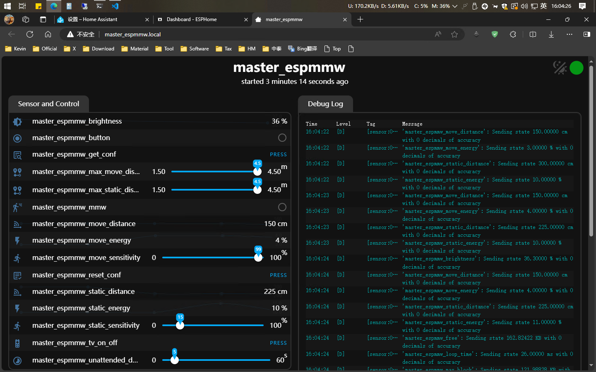

| 组件 | 含义 |
| ---- | ---- |
| `mmw` | 毫米波状态（ON 有人 / OFF 无人） |
| `brightness` | 环境亮度 |
| `button` | 背后按键（见上表） |
| `move_distance` / `move_distance_bar` | 运动距离（数值 / 滑动条） |
| `static_distance` / `static_distance_bar` | 静止距离（数值 / 滑动条） |
| `move_energy` | 运动能量 |
| `static_energy` | 静止能量 |
| `max_detection_range` | 模块硬件最大检测距离（文本，如 `4.5 m (N=6)` / `6.0 m (N=8)`） |
| `max_move_distance` | 最大运动检测距离（1.5–6.0m，步进 0.75；上电查询 + 门限探测自动识别：旧版 4.5m / 新版 6.0m） |
| `max_static_distance` | 最大静止检测距离（同上，自动识别量程） |
| `move_sensitivity` | 运动灵敏度 |
| `static_sensitivity` | 静止灵敏度 |
| `unattended_duration` | 无人持续时间 |
| `auto_sensitivity` | 自动灵敏度校准 |
| `factory_reset` | 恢复出厂（先复位雷达，再清偏好并重启；长按背后键同效） |
| `reboot` | 普通重启 |

### 有人 / 无人触发逻辑

1. `move_energy` **大于** `move_sensitivity` → `mmw` 为 ON（有人）
2. `static_energy` **小于** `static_sensitivity` → `mmw` 为 OFF（无人）
3. 触发 ON 之前只看运动能量；一旦 ON，之后靠静止能量判断是否 OFF
4. 默认 `move_sensitivity: 99`：减少窗帘、衣服微动等误报有人
5. 默认 `static_sensitivity: 15`：更好检出呼吸，减少误报无人
6. 请按现场 `static_energy` 底噪微调；阳台等环境可适当调高静止灵敏度，避免微动导致无法 OFF

### 红外收发

用于学习遥控器 RAW 码后回放，或按指定码执行动作。

- [收 RAW 码教程](https://www.bilibili.com/video/BV1jg411r7mz)

接收：

```yaml
remote_receiver:
  pin:
    number: 0
    inverted: true
  dump: all
```

发送（把日志里的 RAW 码填入 `code`）：

```yaml
remote_transmitter:
  pin: 1
  carrier_duty_percent: 50%
  non_blocking: true

button:
  - platform: template
    name: ${device_name}_tv_on_off
    on_press:
      - remote_transmitter.transmit_raw:
          carrier_frequency: 38kHz
          code:
            [# 日志中的 RAW 码]
```

也可配合 [SmartIR](https://github.com/smartHomeHub/SmartIR)。

### 蓝牙网关

蓝牙与 WiFi 同为 2.4GHz，容易互相干扰，**默认不建议开启**，需自行长期测试。

- 直接采集：[米家低功耗](https://esphome.io/components/sensor/xiaomi_ble.html)、[Bindkey 获取](https://github.com/PiotrMachowski/Xiaomi-cloud-tokens-extractor/releases/latest/download/token_extractor.exe)

```yaml
esp32_ble_tracker:
  - platform: xiaomi_lywsd03mmc
    mac_address: # mac
    bindkey: # bindkey
    temperature:
      name: ${device_name}_mi_temperature
    humidity:
      name: ${device_name}_mi_humidity
    battery_level:
      name: ${device_name}_mi_battery
```

- ESPHome 蓝牙代理：HA `configuration.yaml` 增加 `bluetooth:`，设备侧参考如下（配置后重启，HA 集成中会出现支持的设备）：

```yaml
esphome:
  name: ${device_name}
  on_boot:
    - priority: 600
      then:
        - esp32_ble_tracker.stop_scan:

esp32_ble_tracker:
  scan_parameters:
    interval: 1100ms
    window: 1100ms

bluetooth_proxy:
  active: true

time:
  - platform: sntp
    on_time:
      - seconds: 0
        minutes: /1
        then:
          - esp32_ble_tracker.start_scan:
```

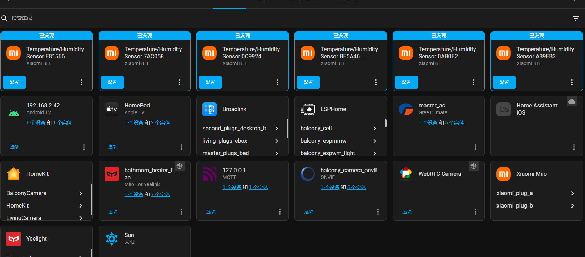

## 注意事项

- 尽量墙上安装，不建议吸顶
- 电源口朝地或朝天，使天线平行地面，探测范围更大
- 安装与雷达范围见 [X-RA2413MT.pdf](https://github.com/liwei19920307/ESPMMW/tree/X-RA2413MT/doc/X-RA2413MT.pdf)

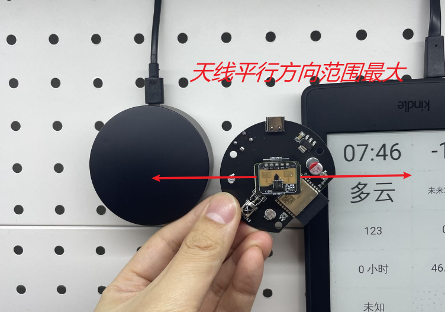

## 问题

有问题欢迎提 Issue，或进讨论群交流。

## 细节

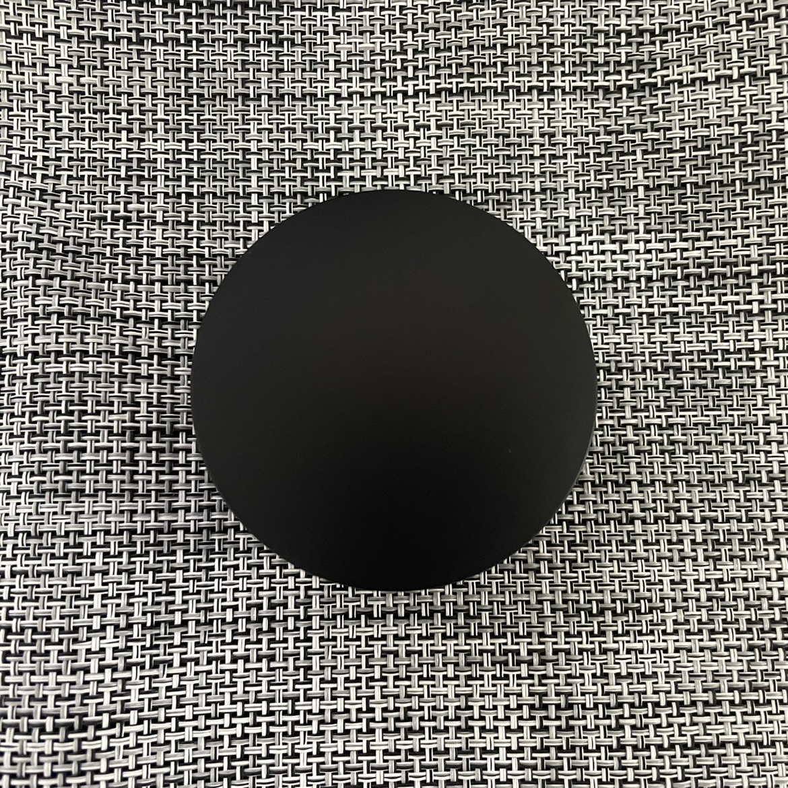

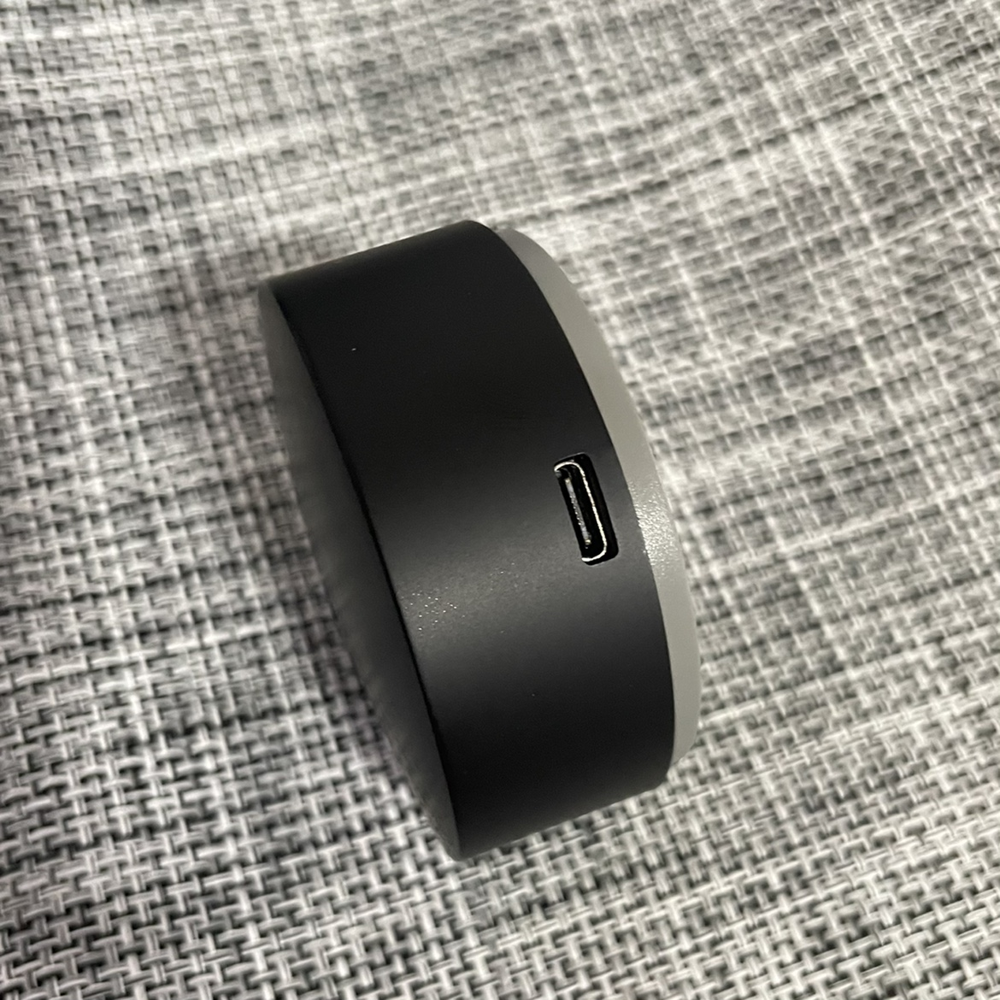

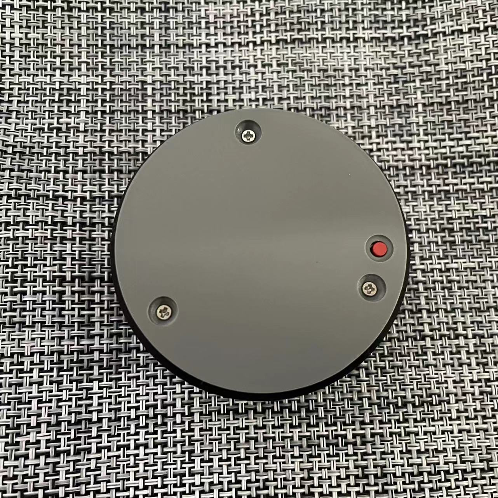

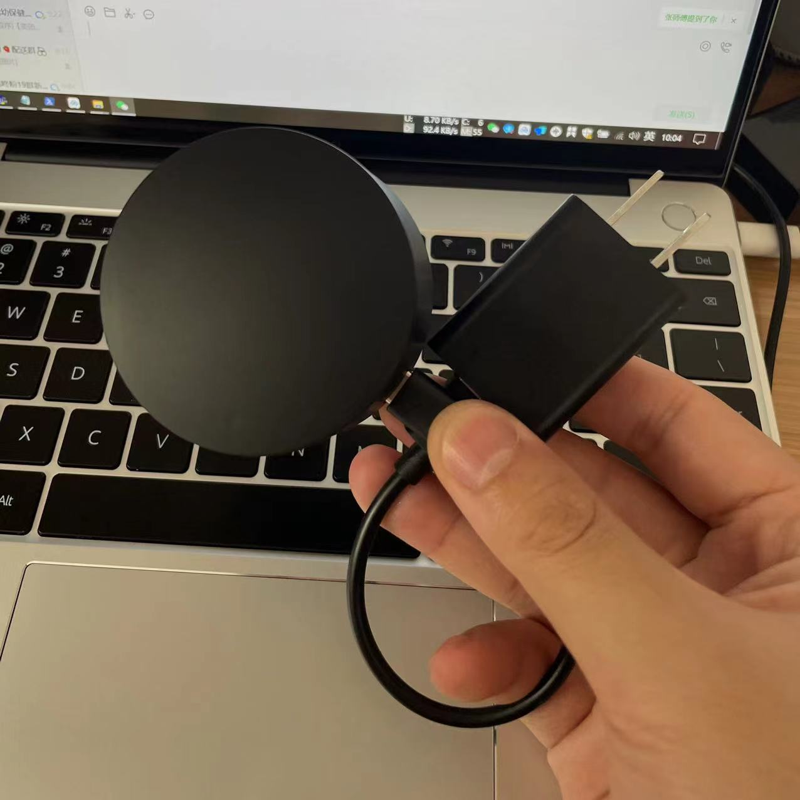

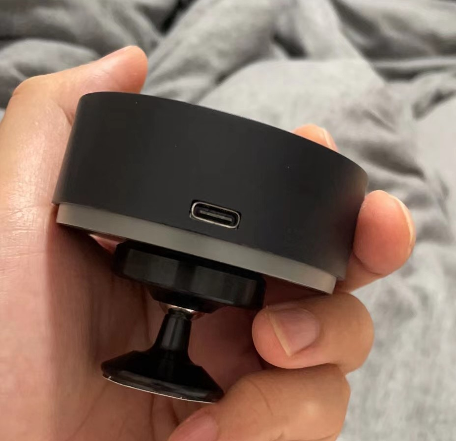

## 场景

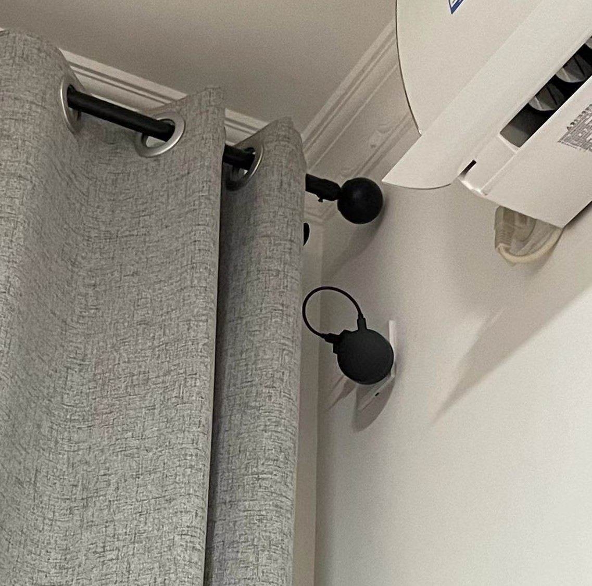

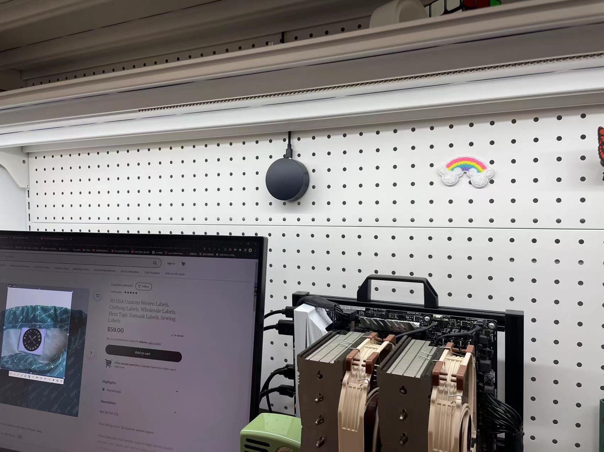

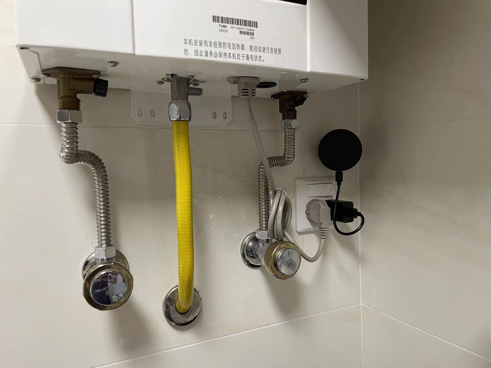
