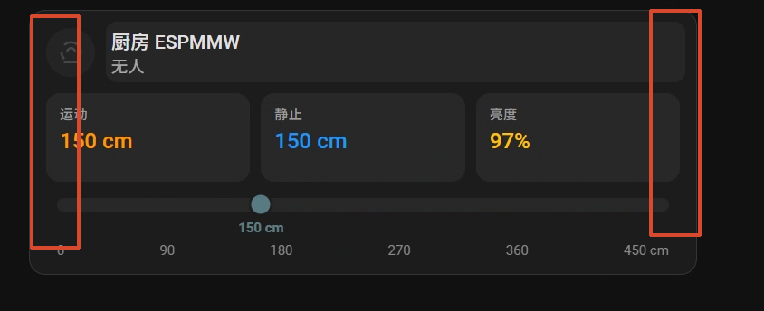

# ESPMMW Card（HA 集成）

ESPMMW / X-RA2413MT 的 Lovelace 卡片，风格贴近官方 Tile：有人状态、运动/静止距离、环境亮度、一维距离尺。



## HACS 安装（推荐）

1. HACS → 右上角三点 → **自定义仓库**
2. 仓库：`https://github.com/liwei19920307/ESPMMW`
3. 类别：**Integration**
4. 搜索 **ESPMMW Card** → 下载
5. **重启 Home Assistant**
6. 设置 → 设备与服务 → 添加集成 → **ESPMMW Card**

## 手动安装

```bash
cp -r custom_components/espmmw_card /config/custom_components/
```

重启 HA，再在「添加集成」中加入 **ESPMMW Card**。

## 添加卡片

```yaml
type: custom:espmmw-card
title: 厨房 ESPMMW
presence: binary_sensor.chu_fang_kitchen_espmmw_x_mmw
move_distance: number.chu_fang_kitchen_espmmw_x_move_distance_bar
static_distance: number.chu_fang_kitchen_espmmw_x_static_distance_bar
brightness: sensor.chu_fang_kitchen_espmmw_x_brightness
max_distance: 450
unit: cm
```

可选字段：

| 字段 | 说明 |
| ---- | ---- |
| `presence` | 有人/无人 binary_sensor |
| `move_distance` / `static_distance` | 距离（sensor 或 number 均可） |
| `move_energy` / `static_energy` | 能量（可选，影响圆点大小） |
| `brightness` | 环境亮度（可选，显示为第三块） |
| `max_distance` | 量程，默认 `450` |
| `unit` | 距离单位，默认 `cm` |

> 实体 ID 以 HA 里实际为准。点击顶栏 / 各块 / 距离尺会打开对应实体的更多信息。

完整示例见 [`dashboard.yaml`](./dashboard.yaml)。

## 资源 URL

集成会自动注册：

`/espmmw_card/espmmw-card.js?v=…`

无需再手动拷贝到 `/config/www/`。
